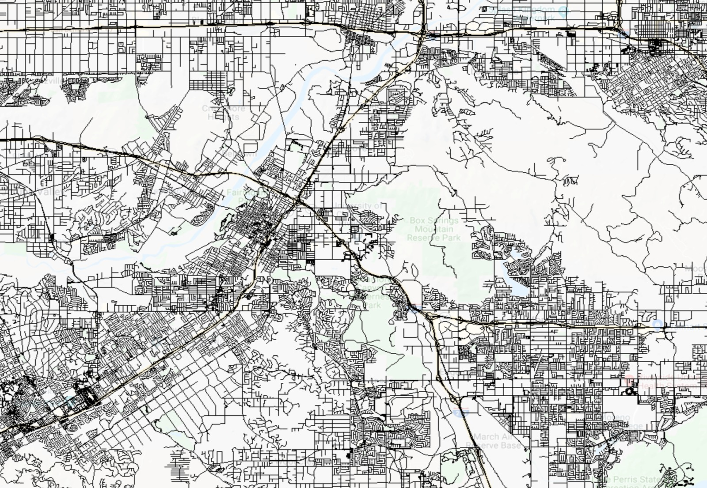
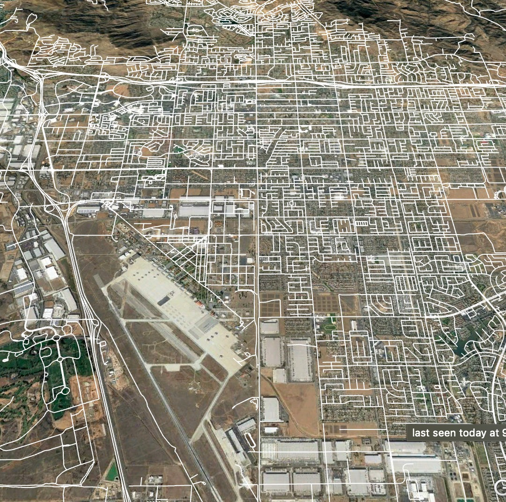
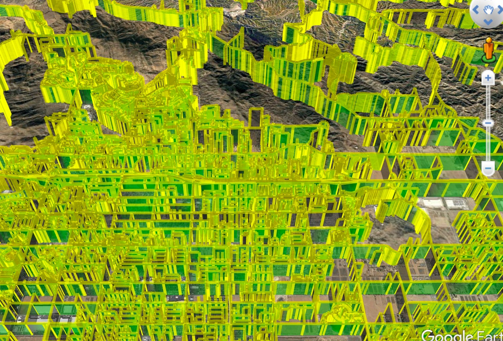

## Summary

This is CS226 Big-Data Management course project. This project is aim to combining 2D road map data with DEM data to generate the 3D road map and visualize it. Here are some output:

For more explaination, pls visit our [report](docs/report.pdf) and [slides](docs/slide.pdf)

## Usage

Enter the root of the project, and use the following code to run the project  

    ./start_spark.sh

Our code can run well in cluster, and there is a same project in there to named "CS226_code". You can also go to that directory and 
use the code mentioned to start it.  

Spark application will generates some intermedia file that contains the geo information of every node. Then script will run the **KML.py** to change the 
format of these data into KML file. 

You can use Google Maps to visualize these KML files.

## Note
In last line of start script, there are two parameters. The first one is the path to the roadmap dataset. Default is the sample dataset 
we generated, since the whole data is too big to run. The second parameter is the number of dem data files being used in the project. There are 
33 data files in total, and we just use two files to generate the result.  

The result of the project will be in the directory "data/output" and "data/output_kml". The "output" saves the output of the spark job and the 
"output_kml" saves the kml files that we generated based on the result of spark. Finally, we download the kml files and use Google Earth to 
visualize it.

## Some Details
We take 1000000 data from original dataset as sample. There is a limitation of memory in the given cluster, we get error when we try to use the whole dataset.
